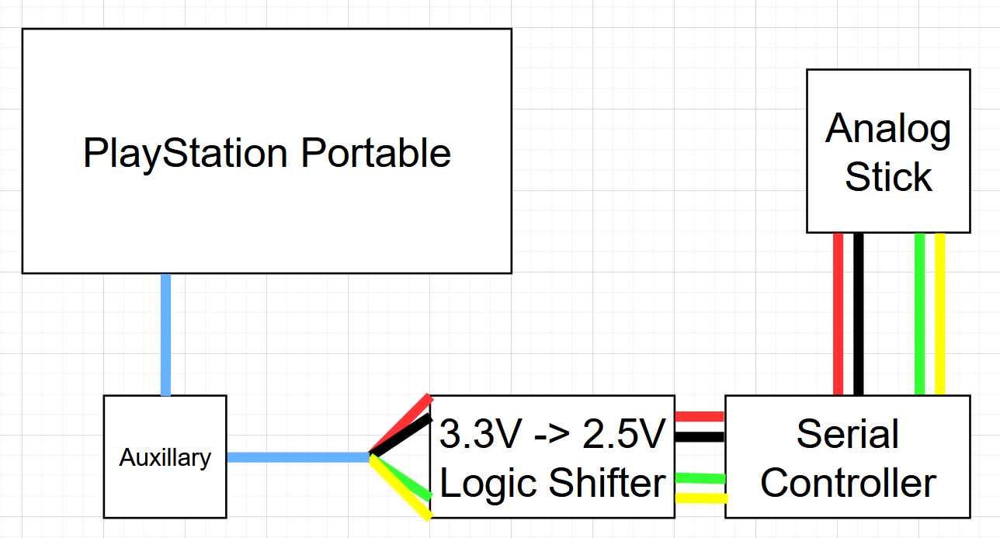

# Operation-DITTO

## Description

An attempt to add native right analog support to the PlayStation portable using Serial I/O.

## How it Works

A second analog nub is connected to a Serial (Teensy) Controller. The PlayStation Portable will send a request for a particular analog axis, which is read by the Teensy and the resulting axis is relayed back to the system. 

For the developer who wants to use this second nub, no additional software is required, nor are changes in their project needed. This is because the OP-DITTO [ctrlHook](https://github.com/Operation-DITTO/ctrlHook) plugin does the work for you by hooking `sceCtrl` and patching `sceCtrlReadBufferPositive()`. `ctrlHook` feeds the second stick into `sceCtrlData.Rsrv[]` - meaning your software will support the second analogs on the PlayStation Vita and DualShock 3 as well!

## The Software

* [ctrlHook](https://github.com/Operation-DITTO/ctrlHook) - The `sceCtrlReadBufferPositive()` patcher.
* [psp-uart-library](https://github.com/Operation-DITTO/psp-uart-library) - A library designed to interfact with the PSP's UART hardware. Powers ctrlHook.
* [teensy-controller](https://github.com/Operation-DITTO/teensy-controller) - The software for the Serial (Teensy) Controller, for interpreting requests sent by ctrlHook and relaying the second analog data back to the system.

## The Operation-DITTO Team

* [z2442](https://github.com/z2442) - design, [shell-cad-files](https://github.com/Operation-DITTO/shell-cad-files), [teensy-controller](https://github.com/Operation-DITTO/teensy-controller), shell assembly
* [MotoLegacy](https://github.com/MotoLegacy) - design, [ctrlHook](https://github.com/Operation-DITTO/ctrlHook), [teensy-controller](https://github.com/Operation-DITTO/teensy-controller), [psp-uart-library](https://github.com/Operation-DITTO/psp-uart-library)

## Extra Credits/Sources

### Software and Info:

* [PSP Auxillary Pinout](http://mc.pp.se/psp/phones.xhtml) documented by [Marcus Comstedt/zeldin](https://github.com/zeldin)
* [PSP-SIO-port-IMU](https://github.com/RndMnkIII/PSP-SIO-port-IMU) by [RndMnkIII](https://github.com/RndMnkIII), primarily for information regarding the need for a logic shifter to run at 2.5V
* All of the CAD (.stl) models were created using [TinkerCAD](https://www.tinkercad.com/).

### People:

* [uOFW Team](https://github.com/uofw) - SystemControl libraries and [`ctrl.prx`](https://github.com/uofw/uofw/tree/master/src/ctrl) reversing.
* [sajattack](https://github.com/sajattack), [Felix-Dev](https://github.com/Felix-Dev/) - Troubleshooting assistance regarding [ctrlHook](https://github.com/Operation-DITTO/ctrlHook).
* [DavisDev](https://github.com/DavisDev), Tyranid†, ps2dev.org forum††, Jean† - [SioDriver](https://github.com/DavisDev/SioDriver/), which [psp-uart-library](https://github.com/Operation-DITTO/psp-uart-library) is built from.
* [Electronic (3D Warehouse)](https://3dwarehouse.sketchup.com/user/0689362566086537234759127/Electronic) - The [PSP model](https://3dwarehouse.sketchup.com/model/b6fed3e446a6860578f8633f5731afa1/Sony-PsP?hl=en) that was originally used to base prototype scales from.

†We couldn't find any verified user accounts associated with this person. If this is you, please come forward so you can receive credit!

††Now defunct.
